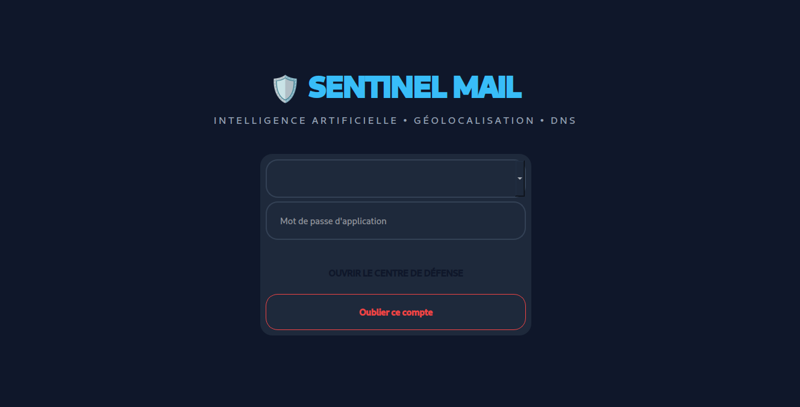
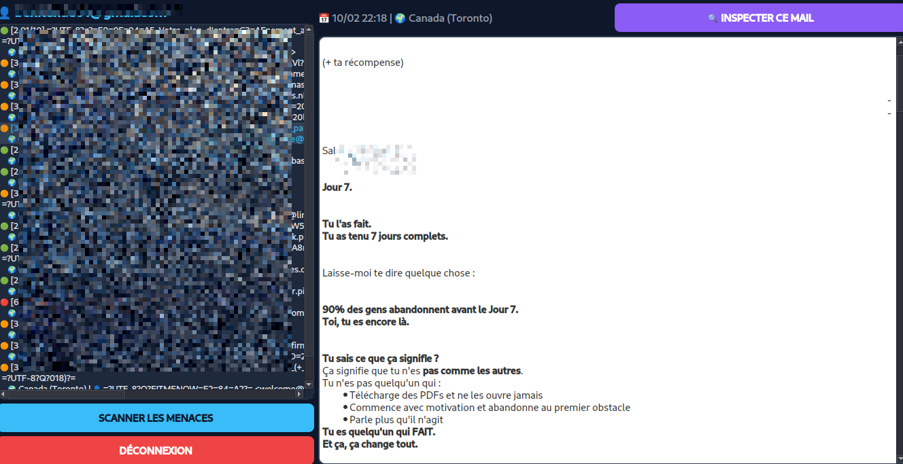
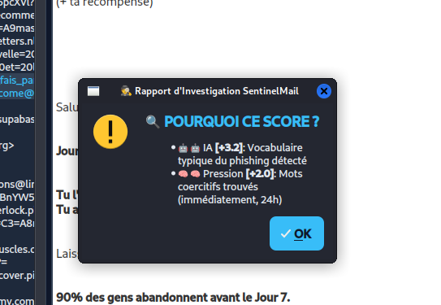

# 🛡️ SentinelMail ULTIMATE V4
> **L'Intelligence Artificielle au service de votre sécurité mail.**

SentinelMail est une sentinelle de défense qui analyse chaque message entrant pour détecter les tentatives de phishing avant que vous ne cliquiez.

### 🔍 Caractéristiques principales :
* 🤖 **Analyse IA (Random Forest)** : Détecte le vocabulaire suspect.
* 🌍 **Geo-Tracking** : Localise l'origine du serveur (DNS/MX).
* 📱 **Détection QR Code** : Analyse les liens cachés dans les images via OpenCV.
* 📄 **Analyse PDF Binaire** : Scanne les scripts malveillants (`/JavaScript`).
* 🔗 **Inspection d'URL** : Repère les adresses IP directes et domaines risqués.
* 🧠 **Score d'Explicabilité** : Comprenez pourquoi un mail est jugé dangereux.

### 💻 Stack Technique :
`Python` | `PySide6` | `Scikit-Learn` | `OpenCV` | `IMAP/SSL`

### 📸 Aperçus de l'application

#### 1. Interface de Connexion

#### 2. Dashboard de Sécurité

#### 3. Module d'Explicabilité (IA)

